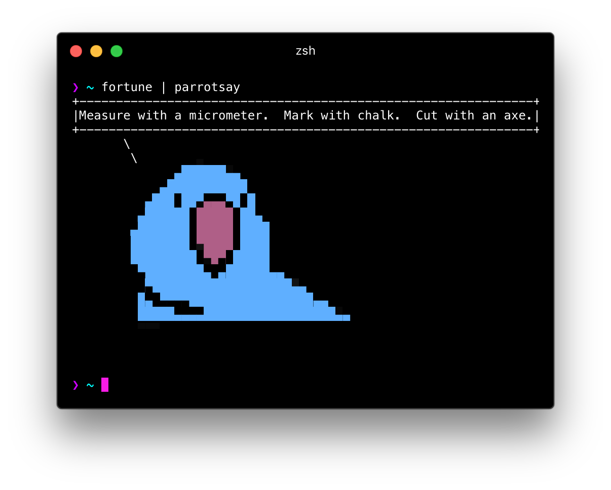

# parrotsay


<!-- TODO: change it to a GitHub url – see https://git.io/hpm README.md -->

## Install

```
npm install --global parrotsay
```

## Usage

`parrotsay yay`

or

`echo 'yay' | parrotsay`

## Related

- [parrotsay-api](https://github.com/matheuss/parrotsay-api) - API for this module
- [Cult of the Party Parrot](http://cultofthepartyparrot.com/)

## Docker

check your parrot fortune

`docker run -t hypergig/parrotsay`

to parrotsay

`docker run -t hypergig/parrotsay yay`

to build

`docker build -t parrotsay docker/.`

## License

MIT © [Matheus Fernandes](http://matheus.top)
